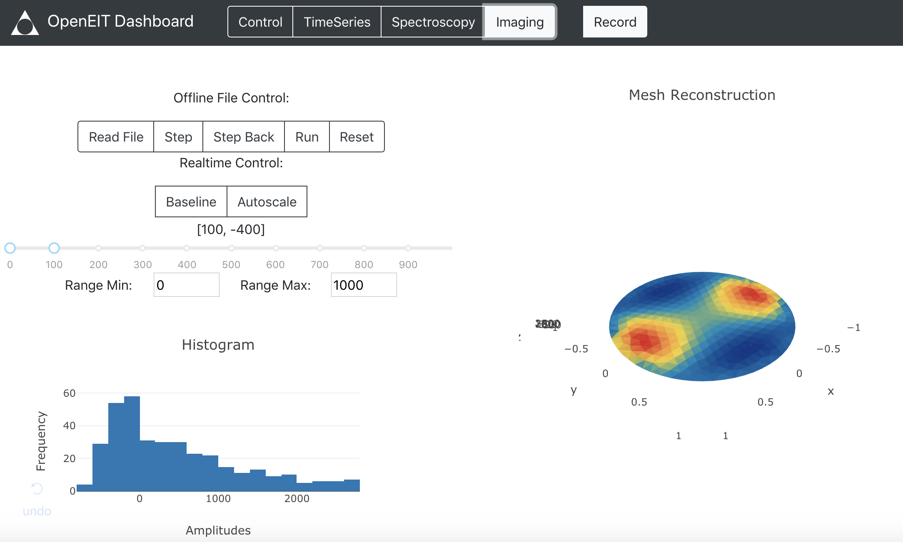
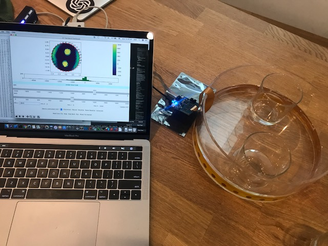

# OpenEIT Dashboard

Biomedical Imaging has previously been expensive and near impossible to hack and experiment with. If more people experimented and understood how imaging works we could move it forward much faster and make these transformative technologies available to everyone. OpenEIT(EIT is for electrical impedance tomography) uses non-ionizing AC current to recreate an image of any conductive material, such as your lungs, arm or head, using the same tomographic reconstruction technique as a CATSCAN. The PCB is only 2" square, with bluetooth, making it a portable and hackable way to do biomedical imaging!

##  How to install the python dashboard. 

## Requirements
```
Python 3.6.1+
```

## Install
```
pip -r requirements.txt
```

## Run
```
python app.py
```
You should now see the server running through the console at a server location accessible by any internet browser at Running on http://127.0.0.1:8050/. To see the dashboard open a browser window(I use chrome) to this address.

The dashboard should now be open and running and look like this: 
{:width="300px"}


## Functionality 



The dashboard can connect to the SPECTRA device via Bluetooth or Serial connection, do tomographic reconstructions in real-time, or by reading in offline data. You can also record data for later analysis. 

In the root OpenEIT folder there are a couple of extra scripts which are helpful when doing analysis. 

# offline.py 

Is an example of how to read in offline data for analysis outside the dashboard. 

# simdata.py 

Simdata creates data in the same format as the hardware device, incase you want to do simulations before collecting real data. 

You can also use the main software to do either time series or bioimpedance spectroscopy. Instructions for these can be found in the readthedocs tutorials. 


## Algorithms 

There are three classic EIT algorithms implemented - Back Projection, Graz Consensus and Gauss Newton Methods using the pyEIT toolbox. Each can be adjusted, optimized and improved upon. It's also possible to create 3D meshes with this software in a similar manner to EIDORS(a matlab based EIT software suite). [a link](https://github.com/liubenyuan/pyEIT)


